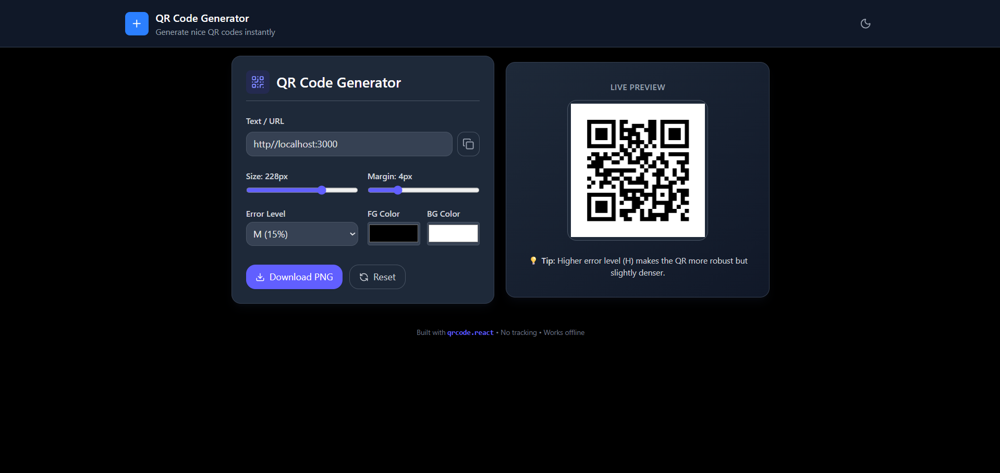

# 📦 **QR Code Generator (React + Tailwind CSS)**

A beautiful and customizable **QR Code Generator** built with **React**, **Tailwind CSS**, and **qrcode.react**. Generate QR codes for **text, URLs, contact info, emails**, and more — with full control over **colors, size, margin**, and **error correction levels**.

---

## ⚡ **Features**

- 🔵 Real-time QR code preview
- 🔵 Supports text, URL, phone, email, etc.
- 🔵 Customizable **size** (slider)
- 🔵 Adjustable **margin**
- 🎨 Change **foreground & background** colors
- 🛡️ Error levels: **L, M, Q, H**
- ⬇️ Download QR as **PNG**
- 📋 One-click copy input text
- 💎 Clean UI with Tailwind CSS
- 📱 Fully responsive layout
- 🌐 Works offline

---

## 🛠️ **Tech Stack**

- **React.js**
- **Tailwind CSS**
- **qrcode.react**
- **Lucide React Icons**

---

## 📁 **Project Structure**

```
src/
│── components/
│     ├── LeftCom.jsx      # Controls and settings panel
│     ├── RightCom.jsx     # Live QR preview section
│── App.jsx
│── index.js
│── styles.css
```

---

### 🏠 Dashboard View



## 🚀 **How to Run Locally**

### 1️⃣ Clone the repository

```bash
git clone https://github.com/Mohd-Affan-Code/QR-code-generator.git
```

### 2️⃣ Install dependencies

```bash
npm install
```

### 3️⃣ Start the development server

```bash
npm run dev
```

Your app will be available on:
👉 **[http://localhost:5173](http://localhost:5173)**

---
